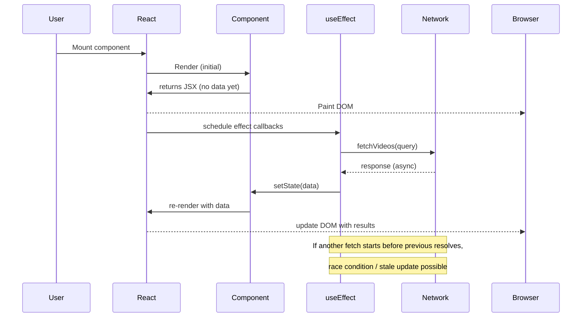

# Understanding Mounts, `useEffect`, `useState`, and Async API Calls — **Complete GitHub Markdown Guide**

> A deep, line-by-line, visual explanation designed for GitHub README usage. This covers component mounts (mount/update/unmount), how `useEffect` and `useState` interact with async API calls, and an exhaustive explanation of the example `fetchVideos` function (Vite + YouTube API). Nothing skipped.

---

## Table of Contents

1. [Quick summary](#quick-summary)
2. [Core concepts: Mount, Update, Unmount](#core-concepts-mount-update-unmount)
3. [How `useState` and `useEffect` work together (conceptual)](#how-usestate-and-useeffect-work-together-conceptual)
4. [Detailed timeline flow (visuals)](#detailed-timeline-flow-visuals)

   * Mermaid sequence
   * ASCII timeline
5. [Common async patterns inside `useEffect` and gotchas](#common-async-patterns-inside-useeffect-and-gotchas)
6. [Advanced topics: cleanup, race conditions, and `AbortController`](#advanced-topics-cleanup-race-conditions-and-abortcontroller)
7. [Practical improvements to the `fetchVideos` function](#practical-improvements-to-the-fetchvideos-function)
8. [Line-by-line explanation of the original snippet](#line-by-line-explanation-of-the-original-snippet)
9. [How to store and use `VITE_` environment variables in Vite](#how-to-store-and-use-vite-environment-variables-in-vite)
10. [Example React component using `fetchVideos` with visuals and explanation](#example-react-component-using-fetchvideos-with-visuals-and-explanation)
11. [Test cases, debugging tips, and checklist before production](#test-cases-debugging-tips-and-checklist-before-production)
12. [Summary / TL;DR cheat sheet](#summary--tldr-cheat-sheet)

---

## Quick summary

* **Mount**: When the component is first created and inserted in the DOM.
* **Update**: When a component re-renders because props or state changed.
* **Unmount**: When the component is removed from the DOM.

`useState` stores component-local state. `useEffect` runs side-effects and can be configured to run on mount, on specific state/prop changes, or on every render. Async API calls commonly happen inside `useEffect`. When doing async work you must consider cleanup and race conditions (component unmounted or a later request arriving earlier).

---

## Core concepts: Mount, Update, Unmount

### Mount

* Definition: The initial creation + insertion of a component tree into the DOM.
* `useEffect(() => { ... }, [])` runs **after** the first render (after the DOM is painted), making it the common place for data fetching and subscriptions.

### Update

* Definition: Any time the component re-renders because of new props or state changes.
* `useEffect(() => { ... })` with no dependency array runs after **every** render (mount + updates).
* `useEffect(() => { ... }, [dep1, dep2])` runs after mount and whenever `dep1` or `dep2` change.

### Unmount

* Definition: Component is removed — cleanups happen here.
* `useEffect`'s cleanup function — the function returned from `useEffect` — runs during unmount (and also before next effect run on updates).

---

## How `useState` and `useEffect` work together (conceptual)

1. **Initial render**: React calls the component function and uses current state values (`useState` initializers run only once).
2. **Commit phase**: React paints the DOM with rendered output.
3. **Effects phase**: React runs `useEffect` callbacks (after painting). This is where you trigger side effects like network requests.
4. **State updates from effects**: When an effect fetches data and calls the state setter (e.g. `setVideos(data)`), React schedules a re-render.
5. **Re-render / update**: The component function runs again with the updated state; DOM updates as necessary; effects may run again depending on dependencies.

Key point: `useEffect` runs **after** render. That means the UI initially renders in the pre-fetched state, then updates when state changes.

---

## Detailed timeline flow (visuals)

### Mermaid sequence diagram (works on GitHub if Mermaid is enabled)



> If Mermaid is unavailable, the ASCII timeline below conveys the same order.

### ASCII timeline (step-by-step)

```
TIME 0: Component is mounted (first render)
  -> Component function runs, reads initial state
  -> JSX returned and DOM painted (no fetched data yet)
TIME 1: Browser shows initial UI (loading or empty)
  -> useEffect runs (after paint)
  -> useEffect triggers fetch (async)
TIME 2: Network request ongoing (in background)
TIME 3: Network responds with data
  -> Effect callback receives data and calls setState(data)
  -> React schedules update (re-render)
TIME 4: Component re-renders with new state (data)
  -> Browser repaints with actual data
```

Important: between TIME 1 and TIME 3 the component might unmount — so you must handle cancellations/cleanup.

---

## Common async patterns inside `useEffect` and gotchas

### Pattern: fetch inside `useEffect`

```js
useEffect(() => {
  let mounted = true; // simple flag
  fetchData().then((data) => {
    if (mounted) setData(data);
  });
  return () => {
    mounted = false; // cleanup
  };
}, [query]);
```

**Why use the `mounted` flag?** To avoid calling `setState` on an unmounted component (which used to warn in older React versions and may cause wasted work or no-ops). Nowadays React no longer logs that specific warning, but it's still good practice to avoid stale updates.

### Gotchas

* **Race conditions**: If query changes quickly (user types), earlier requests might resolve after later ones — causing stale UI. Use `AbortController` or sequence tokens to ignore stale responses.

* **Missing deps in dependency array**: If you rely on values in the effect but omit them from deps, you can close over stale values and cause bugs. Conversely, over-including can cause too many fetches.

* **Running effects on every render**: If you omit deps intentionally, your effect runs after every render — usually a bug for fetches.

* **Async directly in `useEffect`**: `useEffect` callback must not return a Promise. If you want to use `async/await`, define an inner async function and call it.

```js
useEffect(() => {
  const doFetch = async () => {
    const resp = await fetch(...);
    setData(await resp.json());
  };
  doFetch();
}, [deps]);
```

---

## Advanced topics: cleanup, race conditions, and `AbortController`

### Use `AbortController` for cancellation

```js
useEffect(() => {
  const controller = new AbortController();
  const signal = controller.signal;

  const load = async () => {
    try {
      const res = await fetch(url, { signal });
      const json = await res.json();
      setData(json);
    } catch (err) {
      if (err.name === 'AbortError') {
        // fetch was aborted
        return;
      }
      // handle other errors
    }
  };

  load();
  return () => controller.abort();
}, [url]);
```

**Why this helps**: aborting stops the fetch and causes the `fetch` Promise to reject with an `AbortError`. That way you avoid processing results for requests that are no longer relevant.

### Sequence tokens / request IDs

Another strategy is to keep a local monotonic counter and only accept the latest response:

```js
useEffect(() => {
  let current = true;
  const seq = ++requestCounterRef.current;
  fetch(...).then((res) => {
    if (requestCounterRef.current === seq) setData(res);
  });
  return () => { current = false; };
}, [query]);
```

This is more manual but is robust when `AbortController` can't be used (older polyfills) or you want to support more complex logic.

---

## Practical improvements to the `fetchVideos` function

Your original snippet is concise but lacks error handling, `try/catch`, and abort support. Also it uses `import.meta.env` which is Vite-specific — that part is fine if you have a properly configured `.env` file.

### Improved version (handles errors + 429s + abort):

```js
export const fetchVideos = async (query, { signal } = {}) => {
  const API_KEY = import.meta.env.VITE_YOUTUBE_API_KEY;
  const url = `https://www.googleapis.com/youtube/v3/search?part=snippet&q=${encodeURIComponent(
    query
  )}&type=video&maxResults=20&key=${API_KEY}`;

  try {
    const response = await fetch(url, { signal });

    // helpful debugging detail
    if (!response.ok) {
      // You can throw a detailed error for the caller to act on
      const text = await response.text();
      throw new Error(`HTTP ${response.status}: ${text}`);
    }

    const data = await response.json();
    return data.items || [];
  } catch (err) {
    if (err.name === 'AbortError') {
      // fetch was aborted; rethrow or return a sentinel
      throw err; // or return [];
    }
    // Optionally: transform network errors to a known shape
    throw new Error(`Failed to fetch videos: ${err.message}`);
  }
};
```

Notes:

* `encodeURIComponent(query)` prevents malformed queries and injection of special characters.
* We return a safe default `[]` when `data.items` is missing (caller must still handle empty arrays).
* Accepting `{ signal }` allows consumers to pass an `AbortController.signal` from a `useEffect` cleanup.

---

## Line-by-line explanation of the original snippet

Original code (exact):

```js
const API_KEY = import.meta.env.VITE_YOUTUBE_API_KEY;

export const fetchVideos = async (query) => {
  const response = await fetch(
    `https://www.googleapis.com/youtube/v3/search?part=snippet&q=${query}&type=video&maxResults=20&key=${API_KEY}`
  );
  const data = await response.json();
  return data.items;
};
```

### Explanation — every single line

1. `const API_KEY = import.meta.env.VITE_YOUTUBE_API_KEY;`

   * `import.meta.env` is a Vite feature that exposes environment variables at build time.
   * `VITE_` prefix: Vite only exposes environment variables that begin with `VITE_` to the client-side bundle — this prevents accidentally leaking secrets that aren't intended for the browser.
   * `API_KEY` becomes a constant in the module scope. This means the environment value is read once when the module is evaluated (module initialization), not per-call. If you change `.env` and rebuild, this will reflect the new value.

2. `export const fetchVideos = async (query) => {`

   * This declares an **exported** arrow function named `fetchVideos` which is `async` so it returns a Promise.
   * `query` is the search term passed by the caller (e.g., 'javascript tutorials').
   * Exporting it allows other modules to `import { fetchVideos } from './api'`.

3. `const response = await fetch(
     `[https://www.googleapis.com/youtube/v3/search?part=snippet&q=${query}&type=video&maxResults=20&key=${API_KEY}`](https://www.googleapis.com/youtube/v3/search?part=snippet&q=${query}&type=video&maxResults=20&key=${API_KEY}`)
   );`

   * `fetch(...)` is the web Fetch API. It returns a Promise that resolves to a `Response` object if the network request was successful (network-level). HTTP error statuses (4xx/5xx) still resolve the Promise — they do NOT reject.
   * `await` pauses the async function until the fetch Promise resolves. At that point `response` contains the response object.
   * The template string constructs a URL with query parameters:

     * `part=snippet` tells YouTube API to return the snippet objects for videos (title, description, thumbnails, channel info, etc.).
     * `q=${query}` is the search query — unescaped in the original snippet (should use `encodeURIComponent`).
     * `type=video` restricts results to only videos (not channels or playlists).
     * `maxResults=20` asks for up to 20 results.
     * `key=${API_KEY}` appends the API key for authentication/quotas.

4. `const data = await response.json();`

   * `response.json()` reads the response body and parses JSON. It also returns a Promise, so `await` is used.
   * If the response is not valid JSON, this will throw and reject. That's why `try/catch` is useful.

5. `return data.items;`

   * The YouTube `search` endpoint returns an object where `items` is an array of result objects (each contains a `snippet`). This line returns that array to the caller.
   * If the endpoint returned an error object (HTTP 4xx/5xx), `data.items` might be `undefined`. The original function would return `undefined` in that case — a potential source of runtime errors if callers expect an array. That's why returning `data.items || []` or throwing on `!response.ok` is safer.

6. `};` closes the function.

**Behavioral footprint**:

* The function does not handle HTTP errors (`response.ok`), network errors, or cancellations.
* It assumes `API_KEY` is present and valid.
* It assumes the caller will catch any thrown errors.

---

## How to store and use `VITE_` environment variables in Vite

1. Create a `.env` (or `.env.local`) at the project root (same level as `package.json`).

```
# .env
VITE_YOUTUBE_API_KEY=AIzaSy...YOUR_KEY_HERE
```

2. Restart the dev server after editing `.env`.
3. Use in code: `const API_KEY = import.meta.env.VITE_YOUTUBE_API_KEY;`

**Security note**: Any `VITE_` variables become part of the client bundle — they are not secret. Treat API keys used here as public keys or restrict them in the API provider (HTTP referrer restrictions, quotas, etc.). Do NOT store private secrets in `VITE_` env variables.

---

## Example React component using `fetchVideos` with visuals and explanation

This example shows a typical pattern: search input -> `useEffect` triggers fetch -> data displayed. It includes `AbortController` to cancel outstanding requests when query changes or component unmounts.

```jsx
import React, { useState, useEffect, useRef } from 'react';
import { fetchVideos } from './api';

export default function VideoSearch() {
  const [query, setQuery] = useState('');
  const [videos, setVideos] = useState([]);
  const [loading, setLoading] = useState(false);
  const [error, setError] = useState(null);
  const controllerRef = useRef(null);

  useEffect(() => {
    if (!query) {
      setVideos([]);
      return;
    }

    // abort previous
    if (controllerRef.current) controllerRef.current.abort();

    const controller = new AbortController();
    controllerRef.current = controller;

    const load = async () => {
      setLoading(true);
      setError(null);
      try {
        const items = await fetchVideos(query, { signal: controller.signal });
        setVideos(items || []);
      } catch (err) {
        if (err.name === 'AbortError') return; // ignore cancelled
        setError(err.message || 'Unknown error');
      } finally {
        setLoading(false);
      }
    };

    load();

    return () => {
      controller.abort();
    };
  }, [query]);

  return (
    <div>
      <input
        value={query}
        onChange={(e) => setQuery(e.target.value)}
        placeholder="Search YouTube videos..."
      />

      {loading && <p>Loading...</p>}
      {error && <p style={{ color: 'red' }}>{error}</p>}

      <ul>
        {videos.map((v) => (
          <li key={v.id.videoId}>{v.snippet.title}</li>
        ))}
      </ul>
    </div>
  );
}
```

### Explanation of the component (important points)

* `controllerRef` stores the current `AbortController`. On each new effect we abort previous in-progress fetches.
* We guard `if (!query)` so we don't make requests for empty queries.
* We set `loading`, `error` to provide UI feedback.
* `fetchVideos` accepts `{ signal }` and forwards it to `fetch` to enable cancellation.

---

## Test cases, debugging tips, and checklist before production

1. **No API key**: Expect the API to return 403 or 401. Ensure your UI handles missing credentials gracefully.
2. **Rate limits (429)**: Provide UX for rate-limiting (backoff, message to user).
3. **Network offline**: `fetch` will throw; ensure you catch and show user-friendly message.
4. **Invalid JSON**: `response.json()` can throw; handle it.
5. **Rapid query changes**: Ensure only the latest result is displayed (use AbortController or tokens).
6. **Edge-case empty results**: Show "No results found" instead of blank UI.
7. **Security**: Restrict API key to allowed HTTP referrers or use server-side proxy for private keys.

Debugging tips:

* `console.log(response.status, await response.text())` to inspect raw error payloads.
* Use network tab in devtools to confirm requests and headers.

---

## Summary / TL;DR cheat sheet

* Put fetch calls in `useEffect` when they should run after render.
* Always consider cleanups and cancellations when doing async work in effects.
* Use `AbortController` to cancel stale requests.
* Check `response.ok` and handle HTTP errors explicitly.
* Use `encodeURIComponent` for query parameters.
* `import.meta.env.VITE_...` is fine for public client-side keys — do not store secrets there.

---

## Appendix: Quick code snippets

**Simple safe fetch returning empty list on failure**

```js
export async function safeFetchVideos(query) {
  const API_KEY = import.meta.env.VITE_YOUTUBE_API_KEY;
  try {
    const res = await fetch(
      `https://www.googleapis.com/youtube/v3/search?part=snippet&q=${encodeURIComponent(
        query
      )}&type=video&maxResults=20&key=${API_KEY}`
    );
    if (!res.ok) return [];
    const data = await res.json();
    return data.items || [];
  } catch (err) {
    return [];
  }
}
```

**Debounce idea (client-side)**

> Use this to avoid firing a fetch on every keystroke. Example uses a small debounce hook (not provided here) or `setTimeout`/`clearTimeout`.

---

*End of document.*
